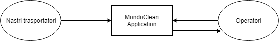
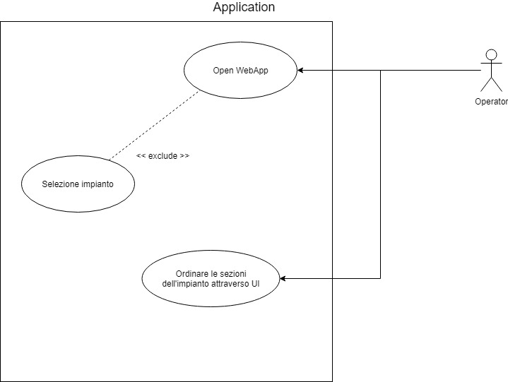
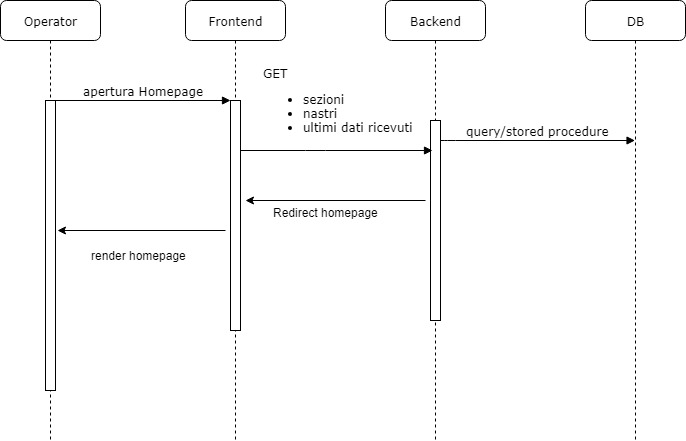
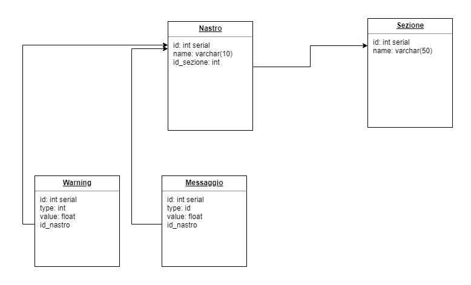

# Esame finale corso TSAC 19 Luglio 2019

Il seguente applicativo ha lo scopo di monitorare un impianto per il riciclo dei materiali.
L'impianto funziona attraverso dei nastri traspostatori.

I nastri causano problemi quando:
- il consumo supera i 60 watt
- la velocità supera i 60 metri al minuto

## Soluzione Applicata
Quando avverrà una delle due conzioni l'operatore riceverà un avviso tramite UI dell'applicazione Web. Una volta che il valore tornerà nei parametri considerati sicuri il messaggio rosso di pericolo sparirà.

L'inserimento nella UI dell'ID (evidenziato dal simbolo ```#```) aiuterà l'utente a comunicare il nastro in pericolo ai propri colleghi, a cui potrà fonire i dati essenziali per intervenire:
- ID della sezione
- ID del nastro
- Ultimi valori registrati

## Strategie applicate, il Cloud

Durante l'analisi della consegna ho capito come uno punti più importanti di questa applicazione fosse quello della velocità nel comunicare i guasti.
Per questo ho utilizzato una sistema di code basato su <b>RabbitMQ</b>.
In particolare ho utilizzato <b>due code</b>:
- coda <i>General</i> in cui vengono gestite le rilevazioni con <b>valori nella norma</b>
- coda <i>Warning</i> per i messaggi contenenti <b>rilevazioni di pericolo</b>.

Il motivo di questa scelta architetturale è molto semplice:
un messaggio di pericolo non può aspettare i messaggi meno importanti, che potrebbero rallentare l'intervento sulla macchina.
## Context diagram

## Use case diagram

## Sequence diagram

## Class diagram
